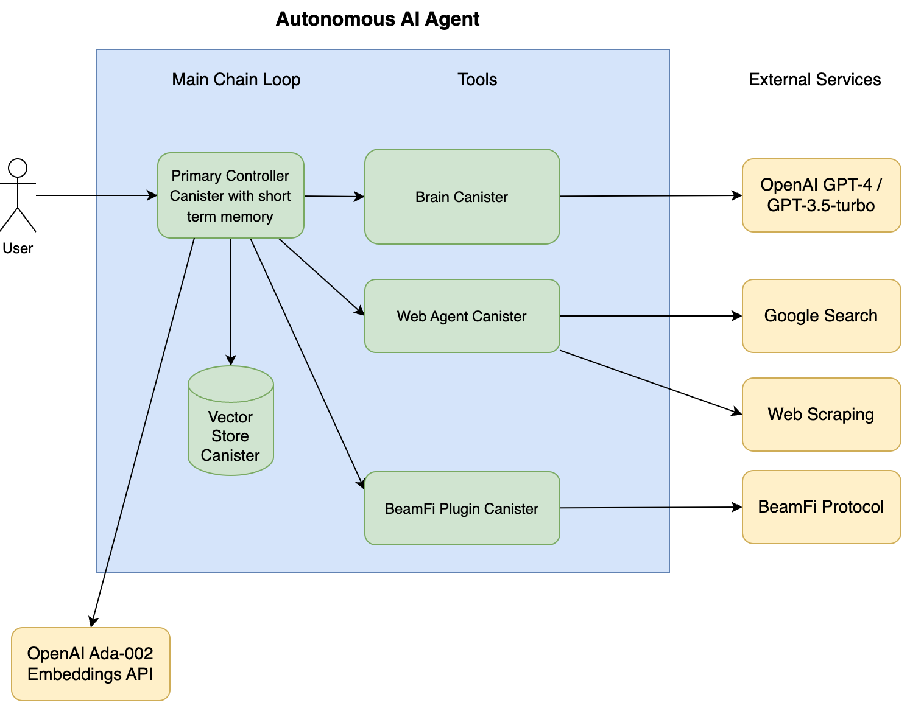

# Arcmind Autonomous AI Agent

ArcMind AI brings Generative AI to organizations using [Autonomous AI Agent](https://www.thoughtworks.com/radar/techniques/llm-powered-autonomous-agents) and [Vector DB](https://developers.cloudflare.com/vectorize/reference/what-is-a-vector-database/) running on [Internet Computer](https://internetcomputer.org/) blockchain, in a privacy-centric and decentralized way. It supercharges your AI workforce with increased LLM faithfulness powered by [Chain of Thoughts](https://blog.research.google/2022/05/language-models-perform-reasoning-via.html) & Long Term Memory.

Technically, ArcMind AI is a Long-Running Agent equipped with a primary main loop that can orchestrate various tools and memory stores to accomplish numerous sub-tasks that make up a larger task. Utilizing the power of LLMs such as GPT-3/4 or other open-source alternatives, these agents can retain both short-term and long-term memory for optimized task execution. For ArcMind, we leverage ArcMind Vector DB Canister as a long-term memory vector store for semantic search, enabling efficient and accurate task execution.

- Every user will have their own suite of Canisters and long-term memory, that can be accessed by their NFID with [ArcMindWeb](https://arcmindai.app/)
- ArcMind AI can communicate with other Canister smart contracts to take action on behalf of users e.g connect to [BeamFi smart contracts](https://github.com/BeamFi/BeamFiProtocol) to stream payment to other users
- Written in robust Rust language

## Demo

User: Explain the benefits of Vitamin D for sleep


See the full demo screenshots of the question at [samples](samples/images/)

We also have a set of other sample Chain of Thoughts questions and responses in the [samples](samples/) folder for you to explore but they use the old Web UI. Simply download the mhtml file with mhtml extension and open it in your browser.

A full video demo is coming soon.

## Prerequisites

- Install Rust Toolchain using rustup  
  Follows https://www.rust-lang.org/tools/install
- Install cargo-audit

```
cargo install cargo-audit
```

- Install dfx sdk  
  Follow https://github.com/dfinity/sdk

## Quick Start

### Setup Environment Variables

1. OPENAI_API_KEY
   Register an OpenAI account and [obtain the API key](https://help.openai.com/en/articles/4936850-where-do-i-find-my-api-key)

1. GOOGLE_API_KEY & GOOGLE_SEARCH_ENGINE_ID
   Follow the instructions to [obtain the API key and search engine ID](https://developers.google.com/custom-search/v1/overview)

1. OWNER_PRINCIPAL

```
dfx identity get-principal
```

1. BEAMFI_PRINCIPAL
   You can use the same principal as OWNER_PRINCIPAL for testing if you don't have BeamFi canister deployed.

1. BILLING_KEY
   You can enter 1234567890 for testing.

### ICP Ledger

Since ArcMind AI has BeamFi Stream Plugin to interact with BeamFi smart contracts, you need to set up the ICP Ledger locally.

Follow the instructions to set up the ICP Ledger locally:
https://internetcomputer.org/docs/current/developer-docs/integrations/ledger/ledger-local-setup

We suggest using `dfx-nns` approach as it's easier to install.

### Running locally

Once the environment variables and local ICP Ledger are all set up, you can run the following commands:

```bash
# Starts the replica, running in the background
dfx start --background

# Deploys controller and brain canisters to the local replica
./scripts/provision-instance.sh
```

The provision script will deploy a suite of canisters.

## Diagrams

Architecture



Chain of Thoughts


## Canisters

ArcMind is composed of 4 canisters with a Main loop controller being the orchestrator and short-term memory store, a brain canister that connects to LLM e.g GPT3.5 / GPT-4, tools, Tools canister that can do Google Search and browse website, and a Vector DB canister that stores long-term memory.

1. [Main loop controller](src/arcmindai_controller/)
1. [Brain connecting to LLM](src/arcmindai_brain/)
1. [Tools](src/arcmindai_tools/)
1. Vector DB - Git submodule, an individual Github repository at [ArcMind Vector](https://github.com/arcmindai/arcmindvector)

The `brain` canister could either connect to LLM remotely or locally hosted open-source LLM like [LLama2](https://github.com/facebookresearch/llama) in the future.

## Interacting with the canisters

All users interactions are done via Main loop controller canister.
We have some [sample shell scripts](/interact) to interact with the controller but the best way is to use [ArcmindWeb](https://arcmindai.app/) to interact with the canisters, which we will make open source soon for the community to contribute. We will provide instructions to run the web app locally.

## Roadmap

- [x] Backend - Design and implement basic Autonomous AI Agent with primary-secondary canisters architecture that is solely controlled and owned by a user who can send basic commands, and run through the secondary canister connecting to external LLM models e.g GPT-4
- [x] Backend - Research and implement the Chain of Thoughts technique in the Primary Canister
- [x] Backend - Implement Web Agent as the first Autonomous AI Agent Tools
- [x] Backend - Research and implement primary canister as long-term VectorStore with Nearest Neighbours distance metric and indexing
- [x] Frontend - Develop basic webapp with NFID to interact with Autonomous AI Agent
- [x] Backend - Develop BeamFi Plugin to allow Autonomous AI Agent to send Beam payments to other ArcMind users
- [x] Payment - Integrate with Stripe payment with a subscription model so that early adopters can start paying for the service to create their own Autonomous Agent and Canisters and fund LLM and API services
- [x] DevOps - Implement an automated ArcMind AI instance provisioning system in GitHub Actions with Canisters and Stripe integration
- [ ] Frontend - Show Goals History, and allow users to open and resume history chat from the existing goals
- [ ] Backend - Self-hosted LLM models for improved performance and privacy
- [ ] Backend/Frontend - Add a new Chain of Thoughts (Cof) command to allow ArcMind AI to ask user question, and prompt user to answer
- [ ] Backend - Add ability to perform independent multi tasks in parallel e.g browser multiple websites and process at the same time
- [ ] Efficient AI - Research on hosting open source Small Language Model (SLM) on Internet Computer for inferencing workflow to improve Chain of thoughts engine performance and user privacy
- [ ] AI Safety - Create Supervisor AI companion to oversee Autonomous Agent (Chain of thoughts) to improve faithfulness and safety
- [ ] AI Safety - Research on problem decomposition approach to encourage context independent reasoning
- [ ] AI Safety - Introduce mentor agent for Cof agent to proactively seek help from when it needs, with a new set of commands and resources
- [ ] AI Safety - Improve prompt engineering to introduce human values and ethics into the AI
- [ ] Integration - Connect to Zapier and IFTTT to allow users to connect to other services and define their own commands for Chain of Thoughts process

## Setting up Github Action CI / CD

Get the string using commands below then put it into Github Secrets.
Note: Replace default by the identity name you need.

### DFX_IDENTITY

```
awk 'NF {sub(/\r/, ""); printf "%s\\r\\n",$0;}' ~/.config/dfx/identity/default/identity.pem
```

### DFX_WALLETS

```
cat ~/.config/dfx/identity/default/wallets.json
```

## License

See the [License](LICENSE) file for license rights and limitations (MIT).

## Contributing

See [CONTRIBUTING.md](CONTRIBUTING.md) for details about how to contribute to this project.

## Authors

Ideas, Code & Architecture: Henry Chan, [henry@arcmindai.app](mailto:henry@arcmindai.app), Twitter: [@kinwo](https://twitter.com/kinwo)

## References

- [Internet Computer](https://internetcomputer.org)
- [Google Research - Language Models Perform Reasoning via Chain of Thought](https://blog.research.google/2022/05/language-models-perform-reasoning-via.html)
- [ThoughtsWorks - LLM-powered autonomous agents](https://www.thoughtworks.com/radar/techniques/llm-powered-autonomous-agents)
- [ReAct: Synergizing Reasoning and Acting in Language Models](https://arxiv.org/abs/2210.03629)
- [AutoGPT](https://github.com/Significant-Gravitas/AutoGPT)
